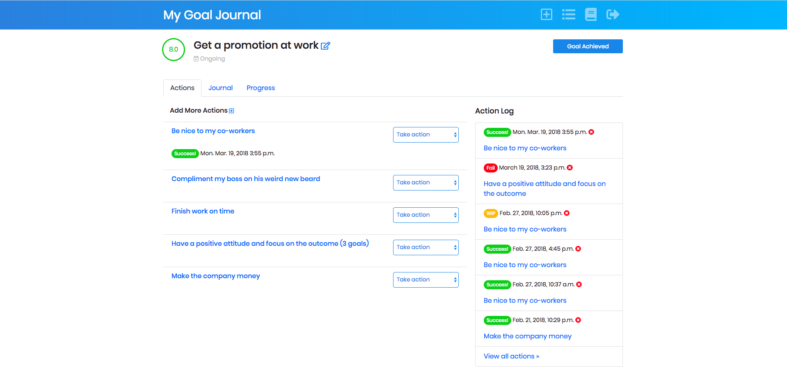
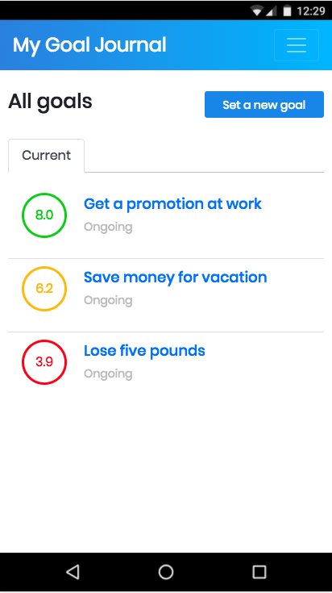

Goal Journal
============

A Django web application for setting and tracking personal goals.

.. image:: https://img.shields.io/badge/built%20with-Cookiecutter%20Django-ff69b4.svg
     :target: https://github.com/pydanny/cookiecutter-django/
     :alt: Built with Cookiecutter Django

:License: MIT

Requirements
------------

* Python 3.6
* Django 1.11
* Postgres 9.2 +

Installation
-------------

1) Clone this repo

2) Create and activate a `virtualenv <http://docs.python-guide.org/en/latest/dev/virtualenvs/>`_ for your installation.

3) Install the project requirements::

    $ pip install -r requirements/local.txt

4) Create a local Postgres database::

    $ createdb goal_journal

5) Run Django migrations, load data for demo version and run the local development server::

    $ python manage.py migrate
    $ python manage.py loaddata users goals journal
    $ python manage.py runserver

6) Point your browser to `http://127.0.0.1:8000/` to get started

Usage
-----

Sign in to the demo account to view the full set of features: 

Username: demo_user

Password: demo_password

Set goals for yourself

Take action to achieve your goals

Track your progress with goal scores, charts and journal

Works great on mobile

Settings
--------

Moved to settings_.

.. _settings: http://cookiecutter-django.readthedocs.io/en/latest/settings.html

Basic Commands
--------------

Setting Up Your Users
^^^^^^^^^^^^^^^^^^^^^

* To create a **normal user account**, just go to Sign Up and fill out the form. Once you submit it, you'll see a "Verify Your E-mail Address" page. Go to your console to see a simulated email verification message. Copy the link into your browser. Now the user's email should be verified and ready to go.

* To create an **superuser account**, use this command::

    $ python manage.py createsuperuser

For convenience, you can keep your normal user logged in on Chrome and your superuser logged in on Firefox (or similar), so that you can see how the site behaves for both kinds of users.

Test coverage
^^^^^^^^^^^^^

To run the tests, check your test coverage, and generate an HTML coverage report::

    $ coverage run manage.py test
    $ coverage html
    $ open htmlcov/index.html

Running tests with py.test
~~~~~~~~~~~~~~~~~~~~~~~~~~

::

  $ py.test

Install Geckodriver for Selenium
^^^^^^^^^^^^^^^^^^^^^^^^^^^^^^^^

Selenium tests require a browser-specific `driver <http://selenium-python.readthedocs.io/installation.html#drivers>`_ .
You can download Geckodriver for Firefox `here <https://github.com/mozilla/geckodriver/releases>`_.

Then add to PATH by running this command from your downloads folder::

    $ mv geckodriver /usr/local/bin

Live reloading and Sass CSS compilation
^^^^^^^^^^^^^^^^^^^^^^^^^^^^^^^^^^^^^^^

Moved to `Live reloading and SASS compilation`_.

.. _`Live reloading and SASS compilation`: http://cookiecutter-django.readthedocs.io/en/latest/live-reloading-and-sass-compilation.html

Deployment
----------

Follow these `instructions <http://cookiecutter-django.readthedocs.io/en/latest/deployment-on-pythonanywhere.html>`_
to deploy and host your installation online with a free `PythonAnywhere <https://www.pythonanywhere.com>`_ account.

